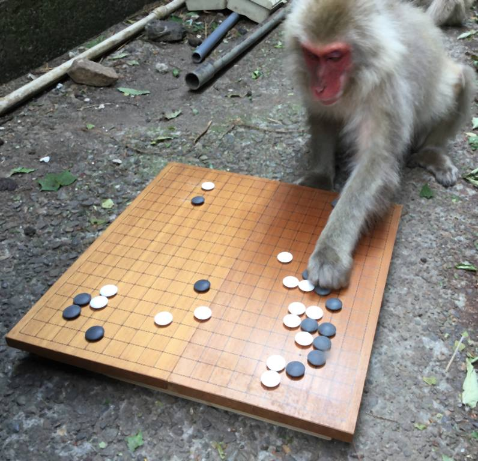
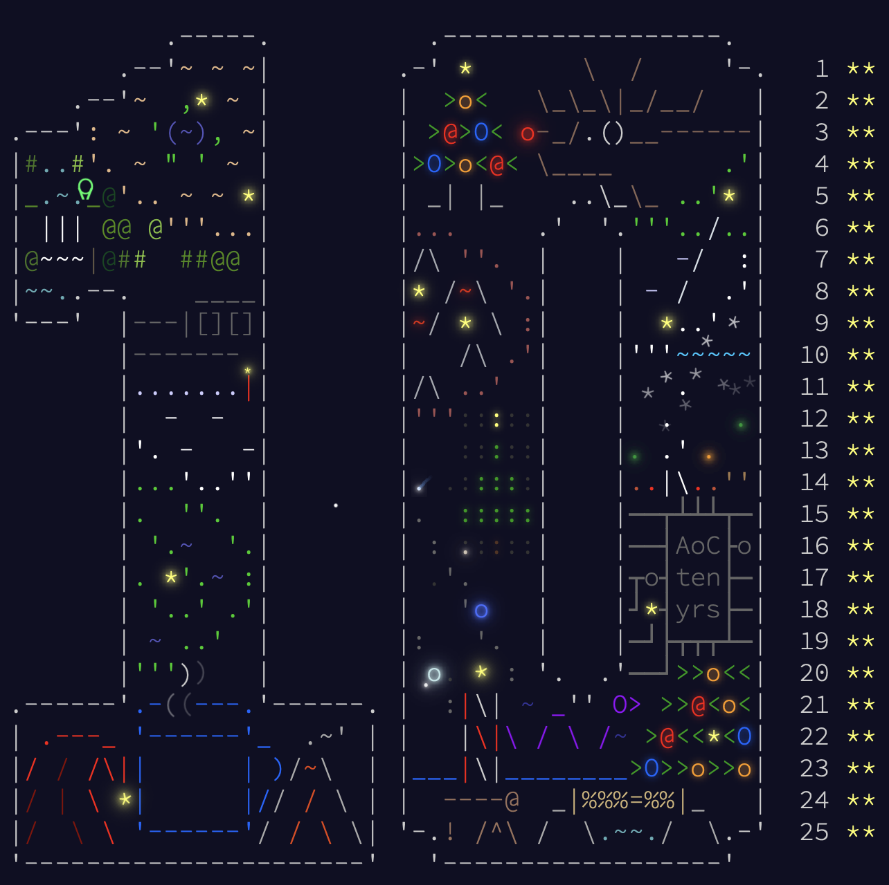

# Timings

| Day  | Time (ms) | % of Total |
|------|-----------|------------|
| 20   | 16.0      | 17.22%     |
| 22   | 15.9      | 17.12%     |
| 16   | 13.9      | 14.96%     |
| 11   | 9.7       | 10.44%     |
| 9    | 9.0       | 9.69%      |
| 12   | 5.5       | 5.92%      |
| 14   | 2.5       | 2.69%      |
| 23   | 2.1       | 2.26%      |
| 19   | 2.0       | 2.15%      |
| 4    | 1.7       | 1.83%      |
| 6    | 1.5       | 1.61%      |
| 17   | 1.4       | 1.51%      |
| 3    | 1.4       | 1.51%      |
| 15   | 1.3       | 1.40%      |
| 21   | 1.2       | 1.29%      |
| 18   | 1.2       | 1.29%      |
| 24   | 1.0       | 1.08%      |
| 7    | 1.0       | 1.08%      |
| 25   | 0.8       | 0.86%      |
| 5    | 0.8       | 0.86%      |
| 2    | 0.8       | 0.86%      |
| 1    | 0.8       | 0.86%      |
| 13   | 0.7       | 0.75%      |
| 8    | 0.6       | 0.65%      |
| Total| 93.7      | 100.00%    |

fastest end-to-end timing minus `cat` time of 100+ runs for part1&2 in ms - mbair M1/16GB - darwin 23.6.0 - go version go1.23.3 darwin/arm64 - hyperfine 1.19.0 - 2024-12

## Installation and benchmark

0. optionnally install [gocyclo](https://github.com/fzipp/gocyclo)
1. install [hyperfine](https://github.com/sharkdp/hyperfine)
2. `git clone` this repository somewhere in your `$GOPATH`
3. `export` envar `$SESSION` with your AoC `session` value (get it from the cookie stored in your browser)
4. `$ cd 2024`
5. `$ make`
6. `$ make runtime && cat runtime.md`
7. explore the other `Makefile` goals

## Day 1: [Historian Hysteria](https://adventofcode.com/2024/day/1)

*This year, I’m freelancing and available to take on projects—preferably in Go or Python. Please help spread the word!*

On this first day of AoC 2024, the challenge seems reasonable. For today’s solution, I’m using `sort` because the problem invites presorted integer data. This choice allows the code to perform [binary searches](https://en.wikipedia.org/wiki/Binary_search) on the right dataset using the left dataset. When factoring in the presorting, the overall [runtime complexity](https://en.wikipedia.org/wiki/Time_complexity) is [o(n log n)](https://go.dev/src/sort/sort.go).

## Day 2: [Red-Nosed Reports](https://adventofcode.com/2024/day/2)

My solution to today’s problem is fairly straightforward. It involves a left-to-right scan to ensure the safety constraints, evolving into a [tail-recursive call](https://en.wikipedia.org/wiki/Tail_call) to tolerate exactly one misplaced element. The only tricky part is when the first item is the misplaced one. In that case, we can simply check whether the report starting from the second element is safe. This approach applies anytime there’s a misplaced element, significantly simplifying the flow of control.

It’s interesting to see that the vast majority of other coders opted to generate all possible reports and brute-force the solution. In contrast, my approach requires at most two generated reports to validate or invalidate any given report and only one of them needs extra memory allocation and data copy.

## Day 3: [Mull It Over](https://adventofcode.com/2024/day/3)

Go should be renowned for its blazing-fast [regular expression](https://en.wikipedia.org/wiki/Regular_expression) matching [engine](https://swtch.com/~rsc/regexp/). I thoroughly enjoyed today’s problem as it reminded me of [Exercice 12](https://clc-wiki.net/wiki/K%26R2_solutions:Chapter_1:Exercise_12) from *[The C Programming Language](https://en.wikipedia.org/wiki/The_C_Programming_Language)*. Combining the two concepts was a delight—and a satisfying way to wrap up the day.

Here's a fun fact collected while analysing my input:

```sh
❯ grep -oE '\w+\([0-9]+,[0-9]+\)' input.txt | sed -E 's/\(([0-9]+,[0-9]+)\)//' | sort | uniq | tr '\n' ' '
354who 953why from how mul select what when where who why
❯ grep -oE '[a-z]+' input.txt | sed -E 's/\(([0-9]+,[0-9]+)\)//' | sort | uniq | tr '\n' ' '
bin do don from how mul mulselect mulwhen mulwho mulwhy perl select t usr what when where who why
❯ grep -oE '.{0,10}perl.{0,10}' input.txt
!/usr/bin/perl@~mul?what
```

Today's problem seems to be a tribute to Perl by [u/topaz](https://x.com/ericwastl/status/1465082878073753600?lang=en), the creator of AoC.

Note: I may revisit this solution at some point.

## Day 4: [Ceres Search](https://adventofcode.com/2024/day/4)

For today's solution, I opted for a sub-matrix matcher that makes multiple passes over the original matrix. It identifies 8 sub-matrices for 'XMAS' and 4 for a valid X-MAS. On the plus side, there's no need for boundary checks, and the matching process is fast. However, the downside is that it requires 12 passes over the original data. That said, the performance is acceptable for now.

```C
var MAS = [][]string{
    {
        "M*M",
        "*A*",
        "S*S",
    },
    {
        "S*M",
        "*A*",
        "S*M",
    },
    ...
}
```

## Day 5: [Print Queue](https://adventofcode.com/2024/day/5)

Today's problem is certainly a brain teaser, but a straightforward approach can still be surprisingly effective. The key insight is that to move from one page number, a, to another, b, it must hold that `a ∈ rules[b]` which is `b is greater than a`. This is the heart of the challenge:

- Part 1 requires verifying that every page number in a given set satisfies this rule.
- Part 2 involves sorting the page numbers so that this rule holds true throughout.

```bash
❯ cat rules.txt | cut -d "|" -f 1 | sort | uniq | wc -l
      49
❯ cat rules.txt | cut -d "|" -f 1 | sort | uniq -c
  24 12
  24 13
  24 14
  24 15
  24 17
  24 18
  24 19
```

The 49 numbers in the set `{ x ∈ I | 12 <= x <= 99 ∧ x%10 != 0 }` each appear exactly 24 times as the left and right sides of all the rules. What’s incredible is that, despite the existence of a global cycle, this structure is sliced in a way that induces [a total ordering](https://en.wikipedia.org/wiki/Total_order). I got lucky this time—I didn't knew about the cycle but didn’t feel like diving into [DAG](https://en.wikipedia.org/wiki/Directed_acyclic_graph), [topological sorting](https://en.wikipedia.org/wiki/Topological_sorting) and stuff so early in AoC (and at breakfast). Instead, I grabbed a good cup of coffee, took a chance, and just sorted it, trusting the relationship a < b ⇔ a ∈ rules[b]. It was so satisfying to see it worked!

## My take on Go 1.23.3

~~The introduction of the iterators and the perimeter of `slices` are somewhat unsatisfactory.
I don't believe this will evolve positively.~~ `<EDIT>` I'm RTFMing.

## Day 6: [Guard Gallivant](https://adventofcode.com/2024/day/6)

This problem has been the most demanding challenge so far. I managed a `20ms+` runtime previously, but now I'm seeing results like:

```bash
counts: 41 8 16.625µs
```

```bash
counts: 4883 1390 1.442291ms
```

It feels like I'm close—but not quite there yet!

`<EDIT>` i'm commiting the version i'm currently working on. It is not done yet (but what is done is blazing fast) and I don't know *for sure* if it can be done this way but i'm confident: All i'm doing now is stacking more
`o(m)` components over an `o(m+n)` core loop.

## Day 7: [Bridge Repair](https://adventofcode.com/2024/day/7)

Today's solution is an elegant recursive, multi-branched [DFS](https://en.wikipedia.org/wiki/Depth-first_search). The key insight is to start from the target value and work *backward*, deconstructing it step by step. This approach naturally prunes certain branches—like divisions or concatenations—when they become impossible.

[](https://www.youtube.com/watch?v=NUgMa5coCoE)

## Day 8: [Resonant Collinearity](https://adventofcode.com/2024/day/8)

Given the size of today's input, [brute-forcing](https://en.wikipedia.org/wiki/Brute-force_search) the solution did the trick.

`<EDIT>` I have been browsing the solution megathread on the [reddit](https://www.reddit.com/r/adventofcode/) and I have a tip for all the LLM-prompters out there. A [cartesian product](https://en.wikipedia.org/wiki/Cartesian_product) to generate all *non repeating* pairs of a set can be expressed as:

```C
for i, a := range set[:len(set)-1] {
    for _, b := range set[i+1:] {
        blah(a, b)
    }
}
```

## Day 9: [Disk Fragmenter](https://adventofcode.com/2024/day/9)

Today, I implemented a compact [filesystem](https://en.wikipedia.org/wiki/File_system) with a [File Allocation Table](https://en.wikipedia.org/wiki/File_Allocation_Table) (FAT) to support file handling primitives, tailored to meet the problem's requirements. [Simulations](https://en.wikipedia.org/wiki/Simulation) are great but surely require a lot of editing to bring their basic concepts to life.

```bash
❯ make lines
      57 ./3/aoc3.go
      72 ./1/aoc1.go
      91 ./8/aoc8.go
      98 ./5/aoc5.go
     101 ./2/aoc2.go
     104 ./7/aoc7.go
     167 ./4/aoc4.go
     234 ./9/aoc9.go
     308 ./6/aoc6.go
    1232 total
```

## Day 10: [Hoof It](https://adventofcode.com/2024/day/10)

As on day 7, DFS proves to be the tool of choice for tackling the problem. Starting from every `0` in the grid, each traversal efficiently identifies all possible paths and their respective goals (`9`). While optimization tricks exist, the small input size means these tweaks wouldn't significantly impact performance.

Got lucky today! Initially, I mistakenly counted the paths instead of the reached goals. I quickly fixed it to focus on goals, only to find that Part 2 required the path count! Both numbers are natural outputs of DFS, so the adjustment was easy.

```bash
      --------Part 1--------   --------Part 2--------
Day       Time   Rank  Score       Time   Rank  Score
 10   00:26:19   4169      0   00:27:48   3435      0
 ```

Today is the *10th* day of the *10th* anniversary of [Advent Of Code](https://en.wikipedia.org/wiki/Advent_of_Code) and my calendar surely looks like it.

## Day 11: [Plutonian Pebbles](https://adventofcode.com/2024/day/11)

In today’s solution, the `Counter` works as a frequency map for integers, making it easy to add and retrieve counts. It processes stones in batches, avoiding unnecessary loops. Last but not least, it [minimizes redundant operations by using direct map access](https://en.wikipedia.org/wiki/Memoization). As a result and for my input, the final and longest line consists of `3799` unique numbers, each appearing one or more times for a total of `223M+` stones.

I really appreciate the minimalism and simplicity of this solution—it is about [design](https://en.wikipedia.org/wiki/Dieter_Rams)!


## Day 12: [Garden Groups](https://adventofcode.com/2024/day/12)

I nearly fried my brain today! The first part of the problem was a breeze—it was similar to Day 10, and adapting my solution didn’t take any effort. But then came Part 2, and it completely blindsided me. My brain froze. Eventually, I decided to take a long break and enjoy a nice breakfast. Only after that was I able to focus, isolate the solution for Part 2, and come up with a simple routine to handle the computation. I’m not finished with this problem yet!

```bash
      --------Part 1--------   --------Part 2--------
Day       Time   Rank  Score       Time   Rank  Score
 12   00:07:21    436      0   00:50:48   1506      0
```

PS. #436 is my personal best. Having detailed day10 was a huge payoff!

## Day 13: [Claw Contraption](https://adventofcode.com/2024/day/13)

Today's problem has a straightforward mathematical solution, specifically solving [systems of two linear equations](https://en.wikipedia.org/wiki/System_of_linear_equations). The key and easy challenge is to avoid [integer overflows](https://en.wikipedia.org/wiki/Integer_overflow). My solution will work out of the box on 64-bit machines, and if needed, a [simple adaptation](https://go.dev/ref/spec#Numeric_types) for 32-bit systems is left for you to handle.

Today's parsing might seem tedious, but it's not! Here's my advice for events like AoC: embrace laziness. The more regular the input format, the easier it is to extract data with quick and efficient string routines instead of, say, regular expressions. Especially during AoC, I always trust the input and [never waste time validating](https://www.youtube.com/watch?v=_oNOTknRTSU) it.

It's Friday, and we've just passed the middle of December. I think today's problem is more of a fun break before the weekend. Stay tuned—I'm betting on some special weekend topics!

PS. So far so good! 3.74 of [cyclomatic complexity](https://en.wikipedia.org/wiki/Cyclomatic_complexity) on average is ok:

```bash
14 main (Maze).run 6/aoc6.go:183:1
14 main solve 10/aoc10.go:43:1
13 main safe 2/aoc2.go:49:1
12 main decompose 12/aoc12.go:49:1
10 main antinodes 8/aoc8.go:59:1
10 main check 7/aoc7.go:47:1
9 main shape 12/aoc12.go:107:1
8 main scan 6/aoc6.go:78:1
8 main main 5/aoc5.go:26:1
7 main (RuneMat).findAll 4/aoc4.go:143:1
Average: 3.74
```

## Day 14: [Restroom Redoubt](https://adventofcode.com/2024/day/14)

What a day! Today's challenge is easy—Part 1 just checks if we’re moving the robots correctly. But Part 2? That’s a whole different game. I had to generate and manually scan 10K+ images with my own eyes to figure it out. The good news? I nailed it and learned something interesting about the easter egg along the way. My advice: don’t peek at the solution unless you’re okay with spoiling the fun!

I have included a visualization routine that outputs a png file in the working directory.


`<EDIT>` I've discovered what seems to be a very fast way to automatically find the Easter egg: simply subsample half of the points and calculate the [standard deviation](https://en.wikipedia.org/wiki/Standard_deviation) along the X and Y axes. There are two keyframes between [0–103] that will have significantly lower deviation on either axis. Once the keyframe times are identified, we can determine the first cycle's coincidence using the [Chinese Remainder Theorem](https://en.wikipedia.org/wiki/Chinese_remainder_theorem). which is kind of a [recurring joke](https://www.reddit.com/r/adventofcode/comments/1hgegw6/comment/m2izyvv/?utm_source=share&utm_medium=web3x&utm_name=web3xcss&utm_term=1&utm_content=share_button) in AoC.

## Day 15: [Warehouse Woes](https://adventofcode.com/2024/day/15)

I tackled today’s challenge in place, using the maze itself as the [data storage](https://en.wikipedia.org/wiki/Data_storage)! On the plus side, this approach comes with built-in visualization. However, the trade-off lies in how the maze needs to be updated. Thankfully, deferring all moves and then filtering out unnecessary clears turned out to be just fine. The code reminds me a weird old but precise clockwork.

```bash
❯ make sample
go run ./aoc15.go < sample.txt
10092 9021
####################
##[].......[].[][]##
##[]...........[].##
##[]........[][][]##
##[]......[]....[]##
##..##......[]....##
##..[]............##
##.........[].[][]##
##......[][]..[]..##
####################
```

## Day 16: [Reindeer Maze](https://adventofcode.com/2024/day/16)

~~I'm not completely satisfied with today's solution.~~ I often say there's not much to discuss when it comes to Dijkstra—it’s like handing the problem over to a computational mycelium, after all: it will eventually be decomposed but it takes time. That said, I ended up using [Dijkstra's algorithm](https://en.wikipedia.org/wiki/Dijkstra%27s_algorithm) twice (RIP problem!):

- first, from the start node to the end node,
- and then from the end node to all other nodes.

 By combining the distance matrices, I was able to reconstruct the best path scores for all traversed cells, selecting only the lowest values. Why go through all that effort? After all, it's straightforward to memorize the paths during the first run, right? Well, while that’s easy to implement, the core loop would end up allocating over 57,000 small chunks (~300 words each) and stall there as a result. The proposed approach shifts that allocation overhead into computing time, making it not only faster but also inherently parallel!

[](https://www.youtube.com/watch?v=EFg3u_E6eHU)

## Day 17: [Chronospatial Computer](https://adventofcode.com/2024/day/17)

Building a computer is a [recurring theme](https://youtu.be/35VIm2ChVUg) in AoC, and once we’ve built a [bytecode](https://en.wikipedia.org/wiki/Bytecode) machine, the next challenge often involves [disassembling and reversing a program](https://youtu.be/hmq6veCFo0Y). Today, the goal was to find a configuration that turns the code into a [quine](https://en.wikipedia.org/wiki/Quine_(computing)). *What an idea!*

Two years ago, I did it painfully with pen and paper. Last year, I went all in with symbolic resolution and variable binding. This year? I kept it simple—I’m trying to save my energy for the challenges ahead.
First, I built a reliable, decently fast emulator. Then, I reversed the program. Finally, I went with a trial-and-error approach: browsing Reddit, checking out different solutions, and eventually settling on [this one in the code](https://www.reddit.com/r/adventofcode/comments/1hg38ah/comment/m2go5os/). The method uses insights from reversing the code to force digits one at a time and then packs the forcing values into a single initial value.

Who knows—maybe I’ll try dynamically forcing the value later on.

```bash
go run ./aoc17.go < input.txt
00 BST 4 A 66245665 00000001 00000000   out:
02 BXL 7 ? 66245665 00000006 00000000   out:
04 CDV 5 B 66245665 00000006 01035088   out:
06 BXL 7 ? 66245665 00000001 01035088   out:
08 BXC 6 C 66245665 01035089 01035088   out:
10 ADV 3 3 08280708 01035089 01035088   out:
12 OUT 5 B 08280708 01035089 01035088   out: 1
14 JNZ 0 0 08280708 01035089 01035088   out: 1
00 BST 4 A 08280708 00000004 01035088   out: 1
02 BXL 7 ? 08280708 00000003 01035088   out: 1
04 CDV 5 B 08280708 00000003 01035088   out: 1
06 BXL 7 ? 08280708 00000004 01035088   out: 1
08 BXC 6 C 08280708 01035092 01035088   out: 1
10 ADV 3 3 01035088 01035092 01035088   out: 1
```

## Day 18: [RAM Run](https://adventofcode.com/2024/day/18)

The key to this challenge is storing the data in a way that efficiently supports [BFS](https://en.wikipedia.org/wiki/Breadth-first_search) operations. Here’s a hint:

```bash
❯ make sample
go run ./aoc18.go < sample.txt
 ∞ 22 25  4  ∞  ∞  ∞
 ∞ 20  5  ∞  ∞ 12 21
 ∞ 13  ∞  ∞  2  ∞  ∞
 ∞  ∞  ∞ 10  ∞  ∞  6
18 17  7  ∞  ∞  1 19
23  8 15  ∞  3 14 16
 9 24 11  ∞  ∞  ∞  ∞
```

Today is a nice boost to keep us going strong for the final stretch. The second part might have been different if we had to navigate the maze at nanosecond speed, but I vaguely remember doing something similar last year. Anyway, it’s time for another great video on BFS!


[](https://www.youtube.com/watch?v=xlVX7dXLS64)

## Day 19: [Linen Layout](https://adventofcode.com/2024/day/19)

Upon reading today’s challenge, I immediately recognized it called for building a [prefix tree](https://en.wikipedia.org/wiki/Trie). Once the trie was in place, the solution involved greedily matching all prefixes, easily achieved through a simple DFS. The result is both [concise and efficient](https://go.dev/doc/effective_go).

I delved deeply into tries after first employing them on [Day 1 of AoC 2023](../2023/README.md).

```bash
      --------Part 1--------   --------Part 2--------
Day       Time   Rank  Score       Time   Rank  Score
 19   00:12:24   1669      0   00:17:08   1351      0
```


## Day 20: [Race Condition](https://adventofcode.com/2024/day/20)

*Oh my gosh!* When I first read the challenge, I had mixed feelings—it seemed simple enough, just a race track, right? But then came the quiet dread: I knew part 2 was coming even before I downloaded my input. I threw everything I could at this challenge, but I'm still not satisfied. I feel like I might have missed something. I can't believe a runtime under 20ms is possible, even in Rust or similar languages. I'll definitely need to take a closer look at other people's solutions for today.

In the meantime, my solution offers *way more* than I initially hoped for. It includes *visualization, a reverse distance matrix, fast tracking, a KD-Tree, and parallelism*. It already feels like *Christmas*!

`<EDIT>` Day 23 taught me a lesson, I believe I have missed the naïve way.

```C
    var shorts1, shorts2 []Shortcut
    maze := newMaze(data, start, goal)

    shorts1 = maze.shortcut(2, 100)
    shorts2 = maze.shortcut(20, 100)

    fmt.Println(len(shorts1), len(shorts2))
```

```bash
Benchmark 2: ./aoc20 < input.txt
  Time (mean ± σ):      32.6 ms ±   0.7 ms    [User: 105.1 ms, System: 20.2 ms]
  Range (min … max):    31.8 ms …  38.1 ms    86 runs
```

[](https://www.youtube.com/watch?v=Glp7THUpGow)

## Day 21: [Keypad Conundrum](https://adventofcode.com/2024/day/21)

Today's solution was one of those that feels incredibly tedious to get right, but once it's done, it seems straightforward.  It’s all about mentally diving into [recursion](https://en.wikipedia.org/wiki/Recursion)—not exactly a strength for most of us. After all, recursion is all about faith—you just have to trust that it will eventually kill the game *without* thinking of it.

Anyway, the key challenge is navigating around the gap to find the shortest path. How you structure your code makes all the difference—it can either be concise and manageable or frustrating and full of errors. It's like a version of Day 11 on steroïds.


*It is also an incredibly smart tribute to [BrainF\*ck](https://en.wikipedia.org/wiki/Brainfuck)*

```C
++++++++[>++++[>++>+++>+++>+<<<<-]>+>+>->>+[<]<-]>>.>---.+++++++..+++.>>.<-.<.+++.------.--------.>>+.>++.
```


## Day 22: [Monkey Market](https://adventofcode.com/2024/day/22)

Quite the reading today. There’s really only one winning strategy: generate all the sequences. It’s a great chance to explore some [tesujis](https://senseis.xmp.net/?Tesuji)—those skillful and decisive tactical moves. With around 40k sequences and a hash function that holds up decently (less than 0.9% collisions on our inputs), there’s no avoiding the full solution. So, the big question is: how can we cut down the runtime without going the dark way?

- Tesuji #1: The only way is to ditch the map, because (props to u/topaz) the *dict hashing itself takes forever*.
- Tesuji #2: It is possible to use a *multicolored map* that is never reinit in between 2 runs.
- Tesuji #3: It is possible to build a *[running index](https://en.wikipedia.org/wiki/Running_key_cipher)* for the sequences.

Those tesujis were skillfully suggested by [`u/ndunnett`](https://www.reddit.com/r/adventofcode/comments/1hjroap/comment/m39nlbn/?utm_source=share&utm_medium=web3x&utm_name=web3xcss&utm_term=1&utm_content=share_button)

```bash
Uniformity & Collision Resistance:
Total samples: 1000000
Distinct hash values: 631991
Mean: 1.582301, Variance: 0.661217

Avalanche Effect:
Avalanche effect (bit difference): 2

Range Coverage:
Coverage: 3.771246%
```



## How is it going?

```bash
❯ make lines
      57 ./3/aoc3.go
      72 ./1/aoc1.go
      81 ./22/aoc22.go
      91 ./8/aoc8.go
      92 ./13/aoc13.go
      98 ./5/aoc5.go
     101 ./2/aoc2.go
     102 ./7/aoc7.go
     107 ./10/aoc10.go
     109 ./11/aoc11.go
     126 ./22/stats/stats.go
     129 ./19/aoc19.go
     138 ./movie/movie.go
     148 ./12/aoc12.go
     175 ./4/aoc4.go
     203 ./18/aoc18.go
     221 ./17/aoc17.go
     223 ./21/aoc21.go
     235 ./15/aoc15.go
     257 ./9/aoc9.go
     258 ./14/aoc14.go
     284 ./16/aoc16.go
     311 ./6/aoc6.go
     320 ./20/aoc20.go
    3938 total
❯ make cyclo
19 main (*Maze).prune 16/aoc16.go:81:1
19 main (Grid).push 15/aoc15.go:95:1
14 main (Maze).run 6/aoc6.go:183:1
14 main solve 10/aoc10.go:43:1
13 main safe 2/aoc2.go:49:1
12 main (*Maze).mktrack 20/aoc20.go:147:1
12 main (*Maze).forward 16/aoc16.go:134:1
12 main decompose 12/aoc12.go:49:1
11 main (Machine).quine 17/aoc17.go:101:1
10 main antinodes 8/aoc8.go:59:1
Average: 3.78
```

## Day 23: [LAN Party](https://adventofcode.com/2024/day/23)

Today's challenge is a classic graph problem that one can solve by throwing [the book](https://arxiv.org/html/2403.09742v1) at it. The task is to find the smallest and largest cliques in the graph. With 520 nodes and 3.3K edges, it's not super heavy, ~~but getting it to run in double-digit milliseconds is no joke~~. In order to get the stars as quickly as possible I resorted to brute force part1 and to [Bron-Kerbosch](https://en.wikipedia.org/wiki/Bron–Kerbosch_algorithm) part2. ~~I'm still working on the solution~~.

*Oh wow, this is incredible! The graph is designed in such a way that a simple, straightforward approach works WAY (x50) better than something complex or fancy. IT EVEN HAS A MISLEADING [EASTER EGG](https://fr.wikipedia.org/wiki/Kata_(programmation))!!! I'm seriously in awe of the effort that went into crafting these challenges!*


Meanwhile, don't forget to cast your vote!


## Day 24: [Crossed Wires](https://adventofcode.com/2024/day/24)

What a wild Day 24! It’s all about a logic board that turns out to be a glitchy [44-bit ripple-carry adder](https://en.wikipedia.org/wiki/Adder_(electronics)#Ripple-carry_adder). I carefully pulled off a fast simulation using a custom connector type. Since the [circuitry](https://en.wikipedia.org/wiki/Electronic_circuit) is [pretty standard](https://www.bermotech.com/wp-content/uploads/2016/08/fulladder.png), I ended up using static [pattern matching](https://en.wikipedia.org/wiki/Pattern_matching) to tackle Part 2.

This challenge pop up from time to time, and I usually struggle with it. But today, I took it slow and steady, and the simulation turned out great!

```bash
go run ./aoc24.go < input.txt
Connector mx05-x05 set to true
Connector hqs-C set to true
Connector mhqs-hqs set to true
Connector fgr-B set to true
Connector z05-C set to true
Connector mz05-z05 set to true
```

[](https://www.youtube.com/watch?v=ZF8nAglC3MU)

## The night before X-Mas

By this point in AoC, I’m usually feeling worn out, but not this year—the challenges have been so good, they’ve kept me strong!
I wish a merry christmas to all christians and more generally to all people that are gathering to share some  quality time.
This is not feeling like a great time though, and I want to express my saddeness, outrage and support to the palestinian people.
Please speak out and Palestine will be free.

```
💔🖤🖤🖤🖤🖤🖤🖤🖤🖤🖤
💔💔🖤🖤🖤🖤🖤🖤🖤🖤🖤
💔💔💔🤍🤍🤍🤍🤍🤍🤍🤍
💔💔💔💔🤍🤍🤍🤍🤍🤍🤍
💔💔💔🤍🤍🤍🤍🤍🤍🤍🤍
💔💔💚💚💚💚💚💚💚💚💚
💔💚💚💚💚💚💚💚💚💚💚
```


## Day 25: Code Chronicle

Today, the challenge was about speed in compositing and suggested a useful method to get the result like a human would. However, a machine could do it faster than what was proposed. Here’s an example of encoding a key or lock into a 35-bit integer:

```bash
#####
##.##
.#.##
...##   -> flatten   #######.##.#.##...##...#...#......
...#.         v
...#.      transcode 1111111011010110001100010001000000
.....
```

And now, the best part of it is that when there is no overlap in between a, b two integers: `a⊕b = a+b`


## How was it?

Happy Birthday, Advent of Code! Here’s to 012 more amazing and successful years! 🎉

I want to start this closing by expressing my awe to [u/topaz](https://www.reddit.com/user/topaz2078/) for this year's edition. It has been so much fun from the start and especially over the last few days. Many of the jokes draw from what's amount to our *[pop culture](https://en.wikipedia.org/wiki/Popular_culture)*.

I wasn't planning to commit, but I ended up syncing up with AoC and waking up at 5:45 am. I must admit, I’m pretty productive early in the morning!

This year's challenges felt simpler than usual, but they covered a broader range of skills. I've seen the best and the worst when it comes to LLMs: generated solutions that worked well for the first few days, and then a slow but steady degradation in code style, performance, and eventually painful, infatuated, useless uggly code. Many prompters have made it to the various leaderboards. Good for them! But in my opinion, they’ve just proved that some of us are [The Goose that Laid the Golden Eggs](https://youtu.be/U3SoVMGpF-E). On the other hand, when you know exactly what you are doing, a co-typist that gladly undertake all the toil is a wonderful tool.

If you're an experienced coder, you know that these solutions are just the tip of the iceberg. For some challenges, I explored different ways to approach the problem and even got deep into the structure of some inputs, or some of the techniques I used throughout December — and for me that's where the fun really comes from. But if you're a beginner, I'd like to share my take on coding in general and solving AoC challenges in particular: You're supposed to have fun. If you're not, step back, take a rest, and do what's best for you.

The fun was at its [peak on Day 23](https://www.reddit.com/r/adventofcode/comments/1hkiqvh/2024_day_23_part_2_it_finally_cliqued/?utm_source=share&utm_medium=web3x&utm_name=web3xcss&utm_term=1&utm_content=share_button) when the example literally screamed `code kata`, and the challenge asked for a maximum clique search in `o(3^(n/3))`—while the problem itself is [`NP-Hard`](https://en.wikipedia.org/wiki/NP-hardness), right? Usually, when working through an algorithm, you have to consider the worst-case scenario, but in this case, it was the complete opposite. The input was skewed toward an impossible best-case scenario — a flower for a naive approach. This meant that *solid beginners* could have perfectly *made it* to the leaderboard *by not knowing any of this*.

Happy coding to you all and props again to `u/topaz`!!!<br>
December 2024, Paris,<br>
e.


