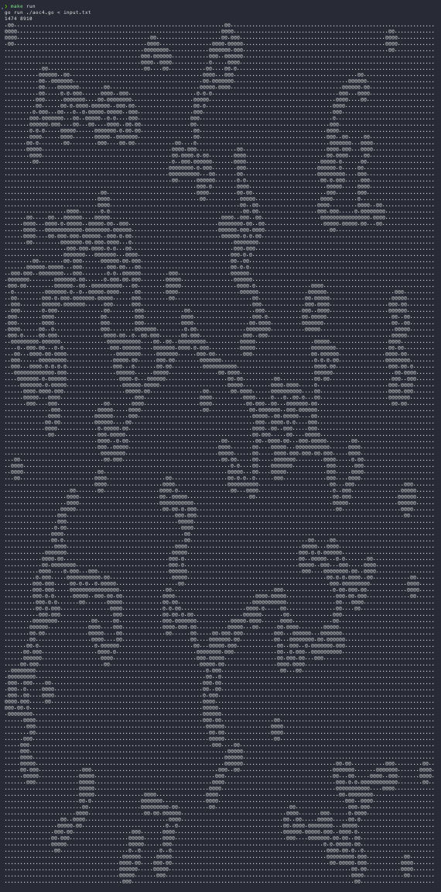

# Summary

This repository contains optimized solutions for Advent of Code 2025, implemented in Go with a focus on performance and educational value.

## Quick Navigation

- [Timings](#timings-) - Performance metrics and hardware specs
- [Installation and Benchmark](#installation-and-benchmark-) - Setup and testing instructions
- [Day 1: Secret Entrance](#day-1-secret-entrance-) - Modulo operations and dial simulation
- [Day 2: Gift Shop](#day-2-gift-shop-) - Repunit numbers and pattern matching optimization
- [Day 3: Lobby](#day-3-lobby-) - Greedy stack-based string manipulation
- [Day 4: Printing Department](#day-4-printing-department-) - Cellular automata and memory optimization
- [A 5mn crash-introduction to cache and GC friendly solutions](#a-5mn-crash-introduction-to-cache-and-gc-friendly-solutions-) - Slices and memory allocation
- [Day 5: Cafeteria](#day-5-cafeteria-) - Range merging
- [Day 6: Trash Compactor](#day-6-trash-compactor-) - Matrix operations and data organization
- [Day 7: Laboratories](#day-7-laboratories-) - Path propagation and dynamic programming
- [Day 8: Playground](#day-8-playground-) - Modified Kruskal's with Distance CutOff
- [Why have I changed the timings?](#why-have-i-changed-the-timings-) - Timings and evaluation

## Timings [↑](#summary)

| Day                                 | Time (μs) | % of Total |
|-------------------------------------|----------:|-----------:|
| [2](#day-2-gift-shop-)              |         8 |      0.26% |
| [7](#day-7-laboratories-)           |        39 |      1.26% |
| [5](#day-5-cafeteria-)              |        98 |      3.18% |
| [1](#day-1-secret-entrance-)        |       136 |      4.41% |
| [6](#day-6-trash-compactor-)        |       154 |      4.99% |
| [3](#day-3-lobby-)                  |       231 |      7.49% |
| [4](#day-4-printing-department-)    |       764 |     24.78% |
| [8](#day-8-playground-)             |     1,653 |     53.62% |
| Total                               |     3,083 |    100.00% |

fastest of 100 runs for part1&2 in μs - mbair M1/16GB - darwin 24.6.0 - go version go1.25.3 darwin/arm64 - 2025-12

## Installation and benchmark [↑](#summary)

0. optionally install [gocyclo](https://github.com/fzipp/gocyclo)
1. `git clone` this repository somewhere in your `$GOPATH`
2. `export` envar `$SESSION` with your AoC `session` value (get it from the cookie stored in your browser)
3. `$ cd 2025`
4. `$ make`
5. `$ make run`
6. explore the other `Makefile` goals

## Day 1: [Secret Entrance](https://adventofcode.com/2025/day/1) [↑](#summary)

*This year, I’m freelancing and available to take on projects—preferably in Go or Python. Please help spread the word!*

<div align="center">
  
</div>

On this first day of AoC 2025, the challenge is reasonably tricky. It highlights the sign ambiguity of the [modulo](https://en.wikipedia.org/wiki/Modulo) operation when the remainder is negative.

For today’s [solution](https://github.com/erik-adelbert/aoc/blob/main/2025/1/aoc1.go), I’m reimplementing `mod` so that it always returns a positive value, since the problem includes negative integer data (i.e., left turns). Then, as always — especially when coding for production — I validate the inputs as early as possible. In this case, it allows me to reduce the computation domain to a single wrap of the dial. By doing this consistently, I don’t need to apply any offsets (and neither do you). From there, a switch selects one of the four interesting cases and updates the counts used as passwords for parts 1 and 2.

`<EDIT>` I've removed `mod()` because it was called only once.

`<EDIT>` I’ve used  `if` [short statements](https://go.dev/tour/flowcontrol/6) fairly liberally as a stylistic choice.

The code runs with an overall (optimal) [time complexity](https://en.wikipedia.org/wiki/Time_complexity) of `O(n)`, where *n* is the number of moves. What’s interesting here is that ~~I don’t believe it’s possible to accidentally end up with a solution that has a higher complexity~~ it doesn't depend on the distance value of the moves.

`<EDIT>` Actually, naïve solutions might (incorrectly) click through each move — fully simulating the dial — which would increase the total loop count by a factor of the distance value *d* resulting in `o(n * d)` (`d_min` for the best case, `d_avg` for the average case or `d_max` for the worst case). This kind of code would be roughly 50~1000× slower than the showcased solution depending on the input.

<details>
  <summary><strong>SPOILER: Click to reveal</strong></summary>
The password method <span title='CLICK'><code>0x434C49434B</code></span> actually encodes a more sensible name.
</details>

## Day 2: [Gift Shop](https://adventofcode.com/2025/day/2) [↑](#summary)

<div align="center">
  
</div>

### Third Approach

As AoC is a gathering, I usually keep a back channel open with my fellow programmer and friend **[hm](https://blog.izissise.net/)**. From the very beginning, he had been insisting on how fast the generation of the numbers we are tasked to find in today’s challenge could be. He was convinced from the start that, given their regular nature, they were natural candidates for efficient generation… and it turns out he was right.

I must admit I wasn’t convinced at first, but once we saw [Tim Visée’s solution](https://github.com/timvisee/advent-of-code-2025/blob/master/day02b/src/main.rs)—which does exactly the opposite by sieving the repeating numbers statically—the challenge was on.

And here it is: possibly **the fastest way** to compute the solution to today’s challenge. It runs in **less than 1 ms**.

This [code](https://github.com/erik-adelbert/aoc/blob/main/2025/2/aoc2.go) runs in `O(k)` time, with *k* being the number of ranges. **It shrinks the original 2M+ search space down to only ~1,800 relevant numbers.** It operates in constant memory and evaluates the repeating-number sums using direct arithmetic formulas.

The flow starts by segmenting the input ranges into sub-ranges aligned on `[10, 1e2, ..., 1e9]` so that the appropriate generating seed values are naturally selected (see the second approach below). Thanks to the structure of the input, this results in only a single split once in a while. Put simply, once the ranges are aligned on successive powers of ten (from 1 to 9 digits), all repeating numbers become multiples of 1 or 2 [Repunit](https://en.wikipedia.org/wiki/Repunit) divisors per range.

From there, given an interval `[a, b]` and its corresponding generating seed `s0`, we simply compute the sum of the multiples of `s0` that fall within the range. The code uses an almost closed-form solution (i.e., an arithmetic formula) to achieve this, along with efficient techniques to handle well-known issues such as eliminating duplicate numbers when different seeds share common multiples within the same range, or merging seeds that become redundant.

### Second Approach

**For the following discussion please checkout commit  [1fd714e](https://github.com/erik-adelbert/aoc/blob/1fd714e7f1a3d37736e4e87a35544bd33a2c852a/2025/2/aoc2.go)**

I have come across a better idea than my original approach and expanded on it. The insight is to exploit the properties of [Repunit](https://en.wikipedia.org/wiki/Repunit) numbers: within each numeric range, the repeating-digit numbers (the ones we need to detect in today’s challenge) are simply multiples of a small set of seed values.

For example, between 10 and 99, it’s easy to see that all repeating numbers are multiples of 11.

The resulting [code](https://github.com/erik-adelbert/aoc/blob/1fd714e7f1a3d37736e4e87a35544bd33a2c852a/2025/2/aoc2.go) stays within the integer domain, the cost effectively disappears — and the routine now runs in **5.8 ms**!

I first saw this idea in [Tim Visée](https://github.com/timvisee/advent-of-code-2025/blob/master/day02b/src/main.rs)’s code.
Tim is a performance-oriented programmer of the finest caliber, and I warmly recommend following his work.

As a final note, this solution uses `fallthrough`, which helps improve runtime.
However, it’s not actually necessary: since part 2 includes part 1, all the
`fallthrough` statements can be replaced with a single `part2 += part1` right before producing the final output.

### First Approach

**For the following discussion please checkout commit [a89bc57](https://github.com/erik-adelbert/aoc/blob/a89bc57abece8df39e0ea2acbf5d6d4a9eae6924/2025/2/aoc2.go)**

On this second day, the code speed conundrum begins: the challenge requires us to convert back and forth between integers and ASCII slices, and to check the allocated memory for certain patterns.

For part 1, the second half of the slice should be a copy of the first.

For part 2, a doubled slice should contain the original slice as a subslice — meaning that the slice is a [rotation of itself](https://en.wikipedia.org/wiki/Ouroboros). This idea is demonstrated in this [study](https://www.geeksforgeeks.org/dsa/a-program-to-check-if-strings-are-rotations-of-each-other/) along with various pattern-searching techniques like [Rabin–Karp](https://en.wikipedia.org/wiki/Rabin–Karp_algorithm) and [KMP](https://en.wikipedia.org/wiki/Knuth–Morris–Pratt_algorithm).

As a matter of fact, the Go standard `bytes` package uses a combination of techniques, including an ultimate fallback to [Rabin–Karp](https://cs.opensource.google/go/go/+/refs/tags/go1.25.4:src/bytes/bytes.go;l=1389).

The [code](https://github.com/erik-adelbert/aoc/blob/a89bc57abece8df39e0ea2acbf5d6d4a9eae6924/2025/2/aoc2.go) runs with a time complexity of `k.O(n)` on average, with *n* being the number of digits in the inputs and *k* some big and hard to compute (at least for me) constant. I will get back to this calculation if I don't find a faster idea for this challenge.

It is worth noting that the solution hits the sweet spot where running `part2` *only* if `part1` fails (ie., [predictive branching](https://en.wikipedia.org/wiki/Branch_predictor))— versus *always* running both `part1` and `part2`  — actually hurts the overall runtime.

The solution itself is pretty neat, but the performance, as you can see, isn’t quite there. I’ll call it a day for now.

<`EDIT>` Actually, the performance is interesting to analyze: given my input, there are 2,244,568 candidates (as shown in the `awk` command above), of which 816 are invalid for part 1 and 895 for part 2. This results in a blazing-fast 43.6 ms / 2,244,568 numbers ≈ 19.4 ns per number for parts 1 and 2 combined. This result feels arguably good.

The search space, although it may not seem like it, is actually quite respectable:

```bash
❯ awk -F',' '{for(i=1;i<=NF;i++){split($i,range,"-"); for(j=range[1];j<=range[2];j++){len=length(j); count[len]++}}} END{for(i in count) print i " digits:", count[i] " numbers" | "sort -n"}' input.txt
1 digits: 8 numbers
2 digits: 81 numbers
3 digits: 758 numbers
4 digits: 8041 numbers
5 digits: 66257 numbers
6 digits: 666270 numbers
7 digits: 413789 numbers
8 digits: 539292 numbers
9 digits: 248595 numbers
10 digits: 301477 numbers
```

```bash
cloc .
       5 text files.
       5 unique files.
       0 files ignored.

github.com/AlDanial/cloc v 2.06  T=0.01 s (657.9 files/s, 10131.5 lines/s)
-------------------------------------------------------------------------------
Language                     files          blank        comment           code
-------------------------------------------------------------------------------
Go                               1             14              6             50
Markdown                         1              0              0              4
Text                             2              0              0              2
make                             1              0              0              1
-------------------------------------------------------------------------------
SUM:                             5             14              6             57
-------------------------------------------------------------------------------
```

`<EDIT>` In Go, [strings](https://go.dev/blog/strings) are immutable, which means many operations on them require allocations. This is why I prefer [byte slices](https://go.dev/blog/slices-intro) in the solution: they allow me to tightly control memory usage and eliminate all allocations from the hot path.

```bash
❯ go test -bench=. -benchmem
goos: darwin
goarch: arm64
pkg: github.com/erik-adelbert/aoc/2025/2
cpu: Apple M1
BenchmarkItoa-8         180716007                6.548 ns/op           0 B/op          0 allocs/op
PASS
```

`<EDIT>` This challenge is also interesting because substring matching efficiently is inherently complex. This is one of the rare cases where the standard library’s implementation has a good chance of being the best tool for the job — despite the unserious performance-critical context. **This last idea of using the standard library is almost absolute if you are a beginner**.

The beauty of [`u/topaz2078`](https://www.reddit.com/user/topaz2078/)’s craftsmanship is that, in this very solution, you’ll see me *simultaneously* relying on Go for the heavy lifting *and* deliberately avoiding it for the ASCII translation. I have the room to exercise my judgment to tilt the solution toward the fast side. For that, I am forever in awe.

## Day 3: [Lobby](https://adventofcode.com/2025/day/3) [↑](#summary)

<div align="center">
  
</div>

Today's challenge is quite straightforward: the goal is to build the *lexicographically largest string after **k** removals*. I chose a [greedy](https://en.wikipedia.org/wiki/Greedy_algorithm), [stack-based](https://en.wikipedia.org/wiki/Stack_(abstract_data_type)) approach to solve it. The [solution](https://github.com/erik-adelbert/aoc/blob/main/2025/3/aoc3.go) is simple, and once again it runs optimally in linear time with respect to the length of the input lines: it is easy  to see that every given digit can only be pushed/popped once.

Having an adhoc `seq` type keeps the main intention obvious while [separating concerns](https://en.wikipedia.org/wiki/Separation_of_concerns). The digit-selection logic becomes a mere implementation detail of the solution. ~~The search space is so small that the Go garbage collector has no time to get in the way, even though the code creates two short-lived small buffers per input line~~.

`<EDIT>` As I wanted to emphasize the `O(1)` space complexity alongside the `O(n)` time complexity of the solution—and to nullify the [Go garbage collector](https://go.dev/doc/gc-guide) pressure altogether—the code now reuses the *same* sequences repeatedly.

```bash
❯ wc -lc input.txt # how many lines and cars?
     200   20200 input.txt
```

## Day 4: [Printing Department](https://adventofcode.com/2025/day/4) [↑](#summary)

<div align="center">
  
</div>

### Current Approach

After seeing various solutions online, I decided to move the double buffering off the grid in favor of a [double-buffered](https://wiki.osdev.org/Double_Buffering) queue, where updates are stored and removals are bulk-applied between steps. Moreover, the queue-based approach processes only the cells that might have changed (the neighbors of removed rolls) rather than scanning the entire grid on each iteration. This transforms the algorithm from a grid-scanning problem into a change-propagation problem, with a time complexity linear in the number of total removals.

This also means that the general theory now relates to [cellular automata](https://en.wikipedia.org/wiki/Cellular_automaton).

The [implementation](https://github.com/erik-adelbert/aoc/blob/main/2025/4/aoc4.go) also eliminates the memory overhead of maintaining two grids by collecting removal positions first, then applying them atomically to prevent corruption during neighbor counting. Combined with preallocated queues and direct array indexing instead of hash maps for deduplication, this optimization achieves a **72% performance improvement** over the original double-buffered approach, bringing the runtime down from 6.5ms to 1.8ms.

### First Approach

**For the following discussion please checkout commit [06ede07](https://github.com/erik-adelbert/aoc/blob/06ede07387eb9f7ca4c23409e15c569aa844321f/2025/4/aoc4.go)**

This challenge is the perfect opportunity to go fully old-school with the solution. It’s an AoC [classic](https://adventofcode.com/2021/day/20) that pops up regularly. It has nothing to do with mathematics and everything to do with programming efficiently for our machines when [processing images](https://en.wikipedia.org/wiki/Digital_image_processing). **If you're a beginner, you could benefit from working through this problem and studying its [various solutions](https://www.reddit.com/r/adventofcode/comments/1pdr8x6/2025_day_4_solutions/).**

My [technique](https://github.com/erik-adelbert/aoc/blob/06ede07387eb9f7ca4c23409e15c569aa844321f/2025/4/aoc4.go) of choice here is to [double-buffer](https://wiki.osdev.org/Double_Buffering) the grid. By doing this, the code kills the removal process with a single [double-stone](https://en.wikipedia.org/wiki/Bolas): it becomes natural to go from one step of the roll removals to the next by updating the *next* buffer from the *current* one and then swapping them.

For the 2D grid itself, nothing beats a [1D grid](https://en.wikipedia.org/wiki/Array_(data_structure)). The code uses two preallocated slices and spatially organizes data on the fly. Except for the initial allocations, the solution once again performs **no memory allocation** on the [hot path](https://en.wikipedia.org/wiki/Hot_spot_(computer_programming)).

I didn't add a blank border to the grid because it would interfere with the index computations—and actually, I don't need to. The showcased code features a *branchless* neighborhood scan that is slightly incorrect because it includes the center roll itself. But this turns out to be beneficial: since we only scan *from* the rolls, it is easy to remove the center cell test in favor of thresholding at 4 rolls (3 neighbors + 1 center) during the entire scan.

The time complexity of *one scan* is `O(n)`: it is easy to see that each cell is processed only once per scan. The total runtime depends on the input, its roll count, and the relative positions. For my input, wich contains 64% of rolls, it takes 70 loops to reduce the grid.

<div align="center">
  
</div>

## A 5mn crash-introduction to cache and GC friendly solutions [↑](#summary)

<div align="center">
  
</div>

I solved the Day 4 challenge without losing sight of the [Go memory model](https://go.dev/ref/mem) and, more broadly, how [memory is managed](https://en.wikipedia.org/wiki/Virtual_memory) in our computers (or at least the much simpler real-life version of it—bear with me). I approached it this way because I strongly believe that [mechanical sympathy](https://newsletter.appliedgo.net/archive/2025-11-30-mechanical-sympathy/) improves program efficiency without requiring any energy beyond the effort of thought.

I’m not going to elaborate on what mechanical sympathy is or what it might mean for us to possess it. In everyday life, it’s much simpler than it sounds. Suppose—purely for the sake of demonstration—you need the best possible performance when thinning a cellular automaton through repeated application of the same rule. Everything works: your logic is flawless, and the result is correct. Naturally, Go slices are extremely useful here and well-suited to the task.

Now, let’s talk about two of the seven benchmarks that you can [find](https://github.com/erik-adelbert/aoc/blob/main/2025/4/aoc4_test.go) alongside the Day 4 solution.

First, let’s look at this one:

```Go
// BenchmarkPreallocatedWithCopy shows the efficient approach for copying
func BenchmarkPreallocatedWithCopy(b *testing.B) {
    src := slices.Repeat([]byte{1}, 1024)
    buf := make([]byte, 1024) // GOOD: allocate once

    for b.Loop() {
        // GOOD: just copy to pre-allocated buffer
        copy(buf, src)

        // Prevent optimization
        sink = buf
    }
}
```

The goal is to create a fresh working copy of a source slice at each iteration of a loop. In this example, everything is fine: the buffers exist at the same scope level, and aside from resetting the contents of `buf` each iteration, nothing ever changes. We never need to modify their size, nor do we need to worry about how memory management might behave, because we’re using them consistently. Right?

But the thing is, in real life we often fixate on small details and lose sight of the bigger picture—and that’s when patterns like this can appear:

```Go
// BenchmarkCarelessAllocations demonstrates the performance impact of allocating
// in tight loops - this is what NOT to do in performance-critical code
func BenchmarkCarelessAllocations(b *testing.B) {
    for b.Loop() {
        // BAD: allocating inside the loop
        buf := make([]byte, 1024)

        // Fill buffer with 1s
        for i := range 1024 {
            buf[i] = 1
        }

        // Prevent optimization by assigning to global
        sink = buf
    }
}
```

The point is the same as before and surely the result is correct. But this time, the code applies maximum pressure by claiming short lived memory at a very high pace in its core loop. It is said to create *friction* with the Go runtime.

What the hell does this mean? Actually, It means this:

```bash
❯ go test -bench="BenchmarkCarelessAllocations$|BenchmarkPreallocatedWithCopy$" -benchmem
goos: darwin
goarch: arm64
pkg: github.com/erik-adelbert/aoc/2025/4
cpu: Apple M1
BenchmarkCarelessAllocations-8           2109789               489.6 ns/op          1024 B/op          1 allocs/op
BenchmarkPreallocatedWithCopy-8         84923436                13.77 ns/op            0 B/op          0 allocs/op
PASS
ok      github.com/erik-adelbert/aoc/2025/4     2.434s
```

Never having to think about the right time and place to declare a buffer can lead to a ×30 slowdown—wasting at least some amount of computing power for no real benefit in return (ie., sub-optimal efficiency).

If you’re interested in reviewing your own solutions for allocation mishaps, you may find the other [five benchmarks](https://github.com/erik-adelbert/aoc/blob/main/2025/4/aoc4_test.go) useful. They illustrate a variety of good and bad patterns you may have used without realizing it, along with an accompanying analysis summarizing the keypoints.

```bash
Running tool: /usr/local/go/bin/go test -benchmem -run=^$ -coverprofile=/var/folders/9y/jfl_qkbs6_9_8xht9qchxhzw0000gn/T/vscode-gobiPhfa/go-code-cover -bench . github.com/erik-adelbert/aoc/2025/4

goos: darwin
goarch: arm64
pkg: github.com/erik-adelbert/aoc/2025/4
cpu: Apple M1
BenchmarkCarelessAllocations-8           	 2826324	       463.9 ns/op	    1024 B/op	       1 allocs/op
BenchmarkPreallocated-8                  	 3608708	       333.2 ns/op	       0 B/op	       0 allocs/op
BenchmarkCarelessAllocationsWithCopy-8   	11459871	       100.8 ns/op	    1024 B/op	       1 allocs/op
BenchmarkPreallocatedWithCopy-8          	88135389	        13.84 ns/op	       0 B/op	       0 allocs/op
BenchmarkWorstCase-8                     	 2897648	       415.0 ns/op	    2560 B/op	       3 allocs/op
BenchmarkRealWorldBad-8                  	 1684596	       711.1 ns/op	    2144 B/op	      11 allocs/op
BenchmarkRealWorldGood-8                 	 2646415	       454.0 ns/op	       0 B/op	       0 allocs/op
PASS
coverage: 0.0% of statements
ok  	github.com/erik-adelbert/aoc/2025/4	8.685s
```

## Day 5: [Cafeteria](https://adventofcode.com/2025/day/5) [↑](#summary)

<div align="center">
  
</div>

I don’t have much to say about today’s challenge. In anticipation of part 2, I used an [interval tree](https://en.wikipedia.org/wiki/Interval_tree). But part 2 ultimately required merging the input ranges and computing the total coverage.

Between the tree querying and the coverage, the time complexity is dominated by `O(m log n)` where *m* is the query count and *n* is the interval count. The storage complexity is, of course, `O(n)`.

The [solution](https://github.com/erik-adelbert/aoc/blob/main/2025/5/aoc5.go) runs in under 1 ms on my inputs, which is perfectly fine. Let’s call it a win!

`<EDIT>` The code now populates the interval tree while tallying coverage from the *merged* intervals. This wasn’t necessary—the speedup is marginal—but it feels more *correct*, and it only required moving a couple of lines around. In the coming days, I’ll remove the tree entirely, since the merged ranges are overlap-free making say a basic binary search perfectly fit for the job.

`<EDIT>` The code now merges the intervals and performs query by bissecting the resulting merged set. It is way lighter now with no visible improvement in runtime (but it was actually ×2 at the μ-level).

```bash
❯ make run
go run ./aoc5.go < input.txt
862 357907198933892
```

### How is it going?

After putting a lot of effort into day 2, I’m quite happy with the total time budget for the first five days: **5.4ms**.

```bash
cloc 1 2 3 4 5
      26 text files.
      23 unique files.
       3 files ignored.

github.com/AlDanial/cloc v 2.06  T=0.03 s (821.8 files/s, 260665.6 lines/s)
-------------------------------------------------------------------------------
Language                     files          blank        comment           code
-------------------------------------------------------------------------------
Text                            10              2              0           6339
Go                               6            153            126            653
Markdown                         5              0              0             20
make                             2              0              0              2
-------------------------------------------------------------------------------
SUM:                            23            155            126           7014
-------------------------------------------------------------------------------
```

## Day 6: [Trash Compactor](https://adventofcode.com/2025/day/6) [↑](#summary)

<div align="center">
  
</div>

The challenge presents a problem that’s a perfect opportunity to practice working with Go [slices](https://go.dev/tour/moretypes/7) and understanding how they relate to the [memory management](https://go.dev/tour/moretypes/7) provided by the Go runtime.

The [solution](https://github.com/erik-adelbert/aoc/blob/main/2025/6/aoc6.go) is very straightforward and mainly involves retrieving and organizing data from the input considered as a byte matrix. The key insight is to extract the matrix layout from the last line: since the operators are left-aligned within their columns, it’s much easier to determine each column’s fixed width from that line than from any other, avoiding altogether the “what kind of space is this space?” conundrum.

I also went a step further and [transposed](https://en.wikipedia.org/wiki/Transpose) the matrix so the numbers are grouped by column. Transposing the column submatrices (i.e., inducing machines to read from top to bottom) is also essential for part two.

The program isn’t the prettiest, but it gets the job done in 85 lines. I believe the code runs in `O(n)` time, where *n* is the number of digits in the matrix. It executes in under 1 ms.

## Day 7: [Laboratories](https://adventofcode.com/2025/day/7) [↑](#summary)

<div align="center">
  
</div>

Today's challenge presents a path propagation problem that I solved using [Dynamic Programming](https://en.wikipedia.org/wiki/Dynamic_programming) principles. The algorithm tracks how paths split and multiply as they traverse the grid from top to bottom.

The [solution](https://github.com/erik-adelbert/aoc/blob/main/2025/7/aoc7.go) adheres to the narrative: It *simulates* paths starting from position 'S' and splitting at each '^' character encountered. When a path hits a '^', it disappears and creates two new paths at adjacent positions (left and right). The code strictly does that and then Part 1 counts the total number of splits that occur, while Part 2 sums all active paths remaining at the end.

An optimization filters the input to only process lines containing '^' or 'S' characters, reducing the effective number of rows that need processing.

The algorithm runs with `O(n)` time complexity, where *n* is the number of grid cells. Each row is processed exactly once, and for each row, we iterate through all possible path positions. The space complexity is `O(w)` for the paths array were *w* is the grid width, making it quite memory-efficient.

It runs in under 1ms.

## Day 8: [Playground](https://adventofcode.com/2025/day/8) [↑](#summary)

<div align="center">
  
</div>

The [solution](https://github.com/erik-adelbert/aoc/blob/main/2025/8/aoc8.go) implements a variant of [Kruskal’s algorithm](https://en.wikipedia.org/wiki/Kruskal%27s_algorithm) for computing a [Minimum Spanning Tree](https://en.wikipedia.org/wiki/Minimum_spanning_tree), but with problem-specific optimizations.

A key observation is that **any edges *after* the one required for Part 2 never affect either answer**.
In other words, the solution has a **distance cutoff**: once we know the maximum edge weight that could possibly matter, every edge longer than that is irrelevant.

By determining this cutoff early, we can **prune the edge set from ~500k to ~5k**, dramatically reducing the work.

This greatly improves runtime because Kruskal’s algorithm—along with the heap and the disjoint-set union (DSU)—runs in time proportional to `O(E log E)`, and reducing `E` by two orders of magnitude makes the whole process significantly faster.

The code runs in under `1.6ms`

## Why have I changed the timings? [↑](#summary)

During AoC I’ve increasingly been comparing my solutions with others written in Rust, and many AoC Rust crates include internal program timers that report raw compute times. On the other hand I have many solutions that are simply to fast for `hyperfine`. Because of this, starting now I will publish **internal timings** instead of external (wall-clock) timings. These internal timings are much more comparable to what Rust and other fast languages report.

For now, my collection of programs solves every day and every part in about **3 ms total**.

```bash
❯ make run
go run ./aoc8.go < input.txt
32103 8133642976 1.692334ms
```
